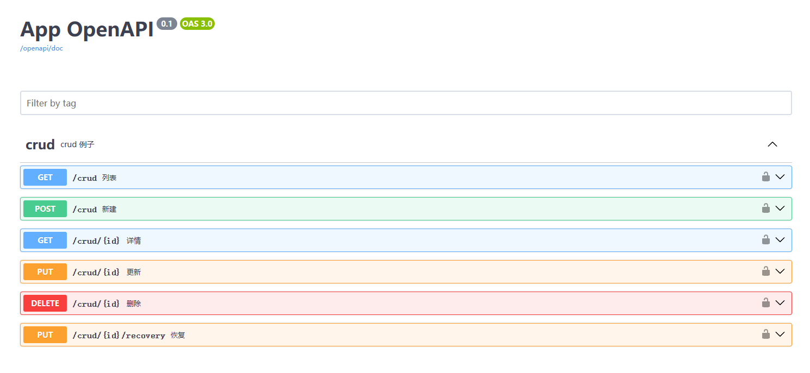
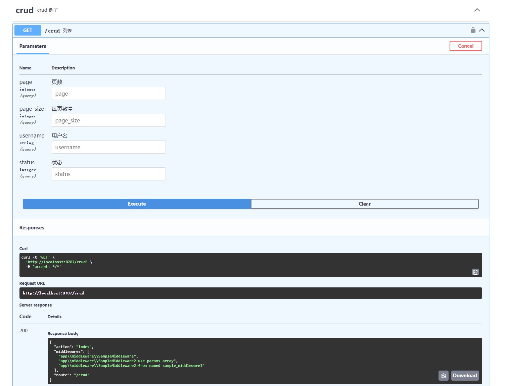

# webman-tech/swagger 注解的使用示例

## swagger UI 界面

## 路由自动注册

1. `config/route.php` 中并没有注册任何路由
2. `config/plugin/webman-tech/swagger/app.php` 中配置 `register_webman_route` 参数为 `true`
3. 查看 `app/controller/ExampleSourceController.php` 中 index 方法的注解（openapi 的注解）
4. 通过 swagger 的交互测试 crud 的例子，可以看到路由 /crud 已经注册成功，并且返回值中能看到 middleware 等也注册成功

