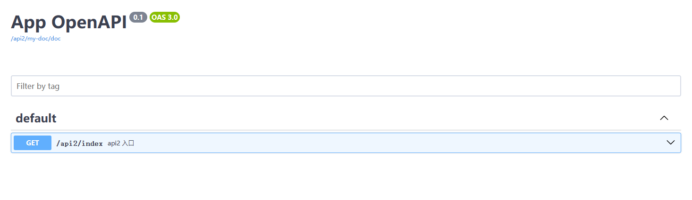

# webman-tech/swagger 多 swagger 示例

1. 在 `config/route.php` 中注册 api1 和 api2 的路由入口
2. 并且设置自动注册 webman 路由
3. 可以分别访问它们的 swagger 文档

**注意：** api1 使用了 Annotation 注释的方式（主要主动安装 `doctrine/annotations` 依赖），api2 使用了 Attribute 注解的方式（需要 php>=8.1），可以同时使用两种方式

http://localhost:8787/api1/openapi#/

http://localhost:8787/api2/my-doc#/

由于没有关闭全局的，因此可以访问全局的 swagger 文档

http://localhost:8787/openapi#/

## 关闭全局的 swagger 文档

配置 `config/plugin/webman-tech/swagger/app.php` 中的 `global_route/enable` 为 false
